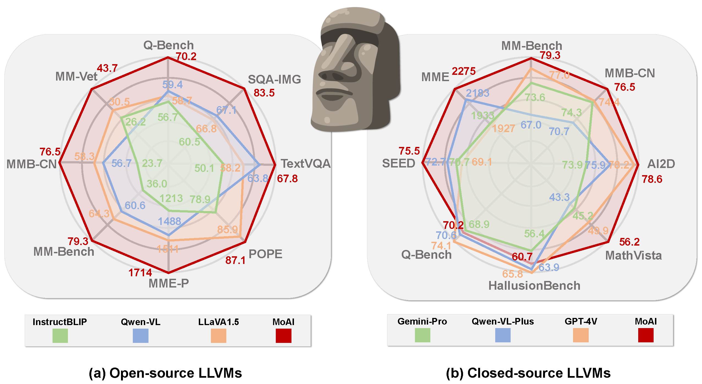
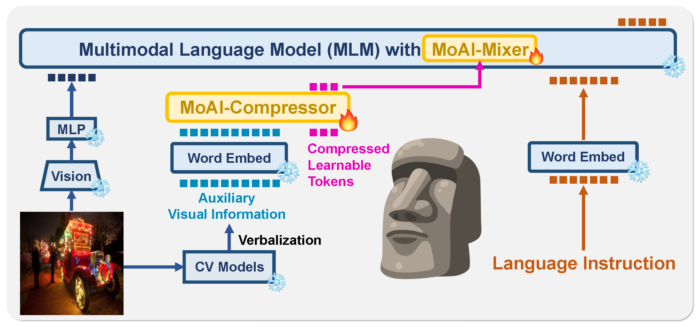
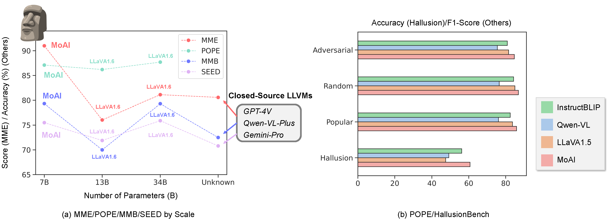

#  ***MoAI: Mixture of All Intelligence for Large Language and Vision Models*** [[ArXiv](https://arxiv.org/abs/2403.07508)]

### MoAI is now available in 🤗[Huggingface Space](https://huggingface.co/BK-Lee/MoAI-7B).
Json files of score results for numerous vision language benchmarks in MoAI are also accessible in [Google Drive](https://drive.google.com/drive/folders/1iUS4KdNyIs2cTBDcRDZxtbnxuxfpg9Vi?usp=sharing).


### 🎨 In-Progress
- [x] Code is public (Only Inference Supported).
- [x] Downloading MoAI-7B is available in Huggingface.
- [x] Huggingface README.md for simple running
- [x] Short running code for an image example is available.
- [ ] Uploading GPT-Aided Evaluation


Official PyTorch implementation code for realizing the technical part of *Mixture of All Intelligence (MoAI)* to improve performance of numerous zero-shot vision language tasks.
This code is developed on two baseline codes of [XDecoder: Generalized Decoding for Pixel, Image, and Language](https://github.com/microsoft/X-Decoder) accepted in [CVPR 2023](https://openaccess.thecvf.com/content/CVPR2023/papers/Zou_Generalized_Decoding_for_Pixel_Image_and_Language_CVPR_2023_paper.pdf)
and [InternLM](https://github.com/InternLM/InternLM) for [Technical Paper](https://github.com/InternLM/InternLM-techreport/blob/main/InternLM.pdf). Please understand the combined code in the current version combining two technical code implementation!

## 🏝️ Summary

The rise of large language models (LLMs) and instruction tuning has led to the current trend of instruction-tuned large language and vision models (LLVMs). This trend involves either meticulously curating numerous instruction tuning datasets tailored to specific objectives or enlarging LLVMs to manage vast amounts of vision language (VL) data. However, current LLVMs have disregarded the detailed and comprehensive real-world scene understanding available from specialized computer vision (CV) models in visual perception tasks such as segmentation, detection, scene graph generation (SGG), and optical character recognition (OCR). Instead, the existing LLVMs rely mainly on the large capacity and emergent capabilities of their LLM backbones. Therefore, we present a new LLVM, Mixture of All Intelligence ( MoAI), which leverages auxiliary visual information obtained from the outputs of external segmentation, detection, SGG, and OCR models. MoAI operates through two newly introduced modules: MoAI-Compressor and MoAI-Mixer. After verbalizing the outputs of the external CV models, the MoAI-Compressor aligns and condenses them to efficiently use relevant auxiliary visual information for VL tasks. MoAI-Mixer then blends three types of intelligence—(1) visual features, (2) auxiliary features from the external CV models, and (3) language features—utilizing the concept of Mixture of Experts. Through this integration, MoAI significantly outperforms both open-source and closed-source LLVMs in numerous zero-shot VL tasks, particularly those related to real-world scene understanding such as object existence, positions, relations, and OCR without enlarging the model size or curating extra visual instruction tuning datasets.


## 🚀 Highlights


<figcaption>
Figure. Comparing the scores and accuracies of numerous VL benchmarks for various open-source and closed-source LLVMs with those for MoAI.
</figcaption>

---


<figcaption>
Figure. Overview of MoAI architecture. Compressed learnable tokens, the parameters of MoAI-Compressor and MoAI-Mixer are learned. `Vision' represents vision encoder to embed visual features and ice/fire symbols represent the modules to freeze or learn. Note that, 'Word Embed' represents the word embedding dictionary of MLM.
</figcaption>

---


<figcaption>
Table. Illustrating zero-shot vision language performances (a) by model size scale compared with the larger open-source LLVMs: LLaVA1.6-13B and -34B, in the latest, and closed-source LLVMs. (b) shows the results of POPE and HallusionBench~, where `Adversarial', `Random', and `Popular' are metrics in POPE. Note the dot points for closed-source LLVMs represent averaged performances with them.
</figcaption>


## Download   MoAI-7B

|                 |    Q-Bench   |  SQA-IMG |  TextVQA |   POPE   |    MME-P   |   MME-C   | MM-Bench |  MMB-CN  |  MM-Vet  |  
|-----------------|:--------:|:--------:|:--------:|:--------:|:----------:|:---------:|:--------:|:--------:|:--------:|
| [InstructBLIP-7B](https://huggingface.co/docs/transformers/model_doc/instructblip) |   56.7   |   49.2   |   60.5   |   50.1   |      -     |     -     |   36.0   |   23.7   |   25.6   |
| [Qwen-VL-7B](https://huggingface.co/Qwen/Qwen-VL) |   59.4   |   67.1   |   63.8   |     -    |   -   |   -   |   38.2   |   7.4   |     -    |
| [LLaVA1.5-7B](https://huggingface.co/docs/transformers/model_doc/llava)     | 58.7 |   66.8   |   58.2   |   85.9   |   1511   |   294   |   64.3   |   58.3   |   30.5   |
| [MoAI-7B](https://huggingface.co/BK-Lee/MoAI-7B/tree/main)      |   **70.2**   | **83.5** | **67.8** | **87.1** | **1714** | **561** | **79.3** | **76.5** | **43.7** |


## 📂 Directory Layout
    .
    ├── asset                           # Required package lists (Important)
    ├── trainer                         # Training MoAI and initializing optimizer (Not Support Now)
    ├── utils                           # Michallengeous util files (Not important)
    ├── moai                            # MoAI architecture & loading moai (Important)
    ├── pipeline                        # Evaluating zero-shot vision language tasks (Important)
    │
    ├── datasets                        # Important
    │   ├── dataset_mappers             # data parsing including augmentation for loader
    │   ├── evaluation                  # measuring evaluation for each dataset 
    │   └── registration                # register dataset
    │
    ├── configs                         
    │   ├── accel                       # Accelerate Config files (Support Deepspeed, DDP, Multinode)
    │   └── moai_eval.yaml              # Evaluating MoAI
    │
    ├── modeling                        # Not Important
    │   ├── architectures               # training the prototype of moai (Not Support Now)
    │   ├── utils                       # utils for modeling (Not important)
    │   └── BaseModel                   # loading and saving model (Important)
    │
    ├── lbk_entry.py                    # main code of control tower (Important)
    ├── run                             # bash file for running the evaluation (Important)
    │
    ├── install                         # install required packages (Important)
    └── README.md

---
## 💡 How to Run?


> In bash file of `install`, you should first run the following lines.


```shell script
conda create -n moai python=3.9
conda activate moai
conda clean -a && pip cache purge
conda install pytorch==2.0.1 torchvision==0.15.2 torchaudio==2.0.2 pytorch-cuda=11.8 -c pytorch -c nvidia
pip install -r assets/requirements/requirements.txt
pip install -r assets/requirements/requirements_custom.txt
pip install flash-attn --no-build-isolation
```

> In addition, you should set the following environment variables to set the dataset path.

```shell script
export DETECTRON2_DATASETS=/path/to/dataset
export DATASET=/path/to/dataset
export DATASET2=/path/to/dataset
export VLDATASET=/path/to/dataset
```
> You should make directory 'checkpoints' in moai/sgg and upload checkpoint of Scene Graph Generation after downloading it, where its checkpoint filename should be 'psgtr_r50_epoch_60.pth'

[Checkpoint Link](https://entuedu-my.sharepoint.com/personal/jingkang001_e_ntu_edu_sg/_layouts/15/onedrive.aspx?id=%2Fpersonal%2Fjingkang001%5Fe%5Fntu%5Fedu%5Fsg%2FDocuments%2Fopenpsg%2Fwork%5Fdirs%2Fpsgtr%5Fr50&ga=1) is from [Panoptic SGG](https://github.com/Jingkang50/OpenPSG).


> At init_detector function in mmdet/apis/inference.py, line 95-110 should be commented to get compatibility. 

```python
# if palette != 'none':
#     model.dataset_meta['palette'] = palette
# else:
#     test_dataset_cfg = copy.deepcopy(config.test_dataloader.dataset)
#     # lazy init. We only need the metainfo.
#     test_dataset_cfg['lazy_init'] = True
#     metainfo = DATASETS.build(test_dataset_cfg).metainfo
#     cfg_palette = metainfo.get('palette', None)
#     if cfg_palette is not None:
#         model.dataset_meta['palette'] = cfg_palette
#     else:
#         if 'palette' not in model.dataset_meta:
#             warnings.warn(
#                 'palette does not exist, random is used by default. '
#                 'You can also set the palette to customize.')
#             model.dataset_meta['palette'] = 'random'
```

> At inference_detector function in mmdet/apis/inference.py, line 179- should be changed by the following lines. 

```python
# build the data pipeline
data_ = test_pipeline(data_)

data_['inputs'] = data_['inputs'].unsqueeze(0)
data_['data_samples'] = [data_['data_samples']]

# forward the model
with torch.no_grad():
    results = model.test_step(data_)[0]
```

> In mmcv/transforms/processing.py, line 388 should be commented to get compatibility. 

```python
# results['img_shape'] = padded_img.shape[:2]
```

> Download MoAI Model and then run the demo script,

```python
"""
MoAI-7B

Simple Six Steps
"""

# [1] Loading Image
from PIL import Image
from torchvision.transforms import Resize
from torchvision.transforms.functional import pil_to_tensor
image_path = "figures/moai_mystery.png"
image = Resize(size=(490, 490), antialias=False)(pil_to_tensor(Image.open(image_path)))

# [2] Instruction Prompt
prompt = "Describe this image in detail."

# [3] Loading MoAI
from moai.load_moai import prepare_moai
moai_model, moai_processor, seg_model, seg_processor, od_model, od_processor, sgg_model, ocr_model \
    = prepare_moai(moai_path='/mnt/ssd/lbk-cvpr/MoAI/final', bits=4, grad_ckpt=False, lora=False, dtype='fp16')

# [4] Pre-processing for MoAI
moai_inputs = moai_model.demo_process(image=image, 
                                    prompt=prompt, 
                                    processor=moai_processor,
                                    seg_model=seg_model,
                                    seg_processor=seg_processor,
                                    od_model=od_model,
                                    od_processor=od_processor,
                                    sgg_model=sgg_model,
                                    ocr_model=ocr_model,
                                    device='cuda:0')

# [5] Generate
import torch
with torch.inference_mode():
    generate_ids = moai_model.generate(**moai_inputs, do_sample=True, temperature=0.9, top_p=0.95, max_new_tokens=256, use_cache=True)

# [6] Decoding
answer = moai_processor.batch_decode(generate_ids, skip_special_tokens=True)[0].split('[U')[0]
print(answer)
```


> If you want to valiate zero-shot performances in numerous datasets, then running the bash file 'run'.

```shell bash
GPU_DEVICE="0,1,2,3,4,5"
length=${#GPU_DEVICE}
n_gpu=$(((length+1)/2))
main_port=10000
test_batch=1 # (Must be Necessary)

CUDA_VISIBLE_DEVICES=$GPU_DEVICE \
accelerate launch --config_file configs/accel/ddp_accel.yaml \
    --num_processes=$n_gpu \
    --main_process_port=$main_port \
    lbk_entry.py eval \
    --conf_files configs/moai_eval.yaml \
    --overrides \
    WANDB False \
    DATASETS.TEST mme \
    PIPELINE MMEPipeline \
    MME.TEST.BATCH_SIZE_TOTAL $((n_gpu * test_batch)) \
    SCIENCEQA.TEST.BATCH_SIZE_TOTAL $((n_gpu * test_batch)) \
    POPE.TEST.BATCH_SIZE_TOTAL $((n_gpu * test_batch)) \
    MMBENCH.TEST.BATCH_SIZE_TOTAL $((n_gpu * test_batch)) \
    MMVET.TEST.BATCH_SIZE_TOTAL $((n_gpu * test_batch)) \
    AI2D.TEST.BATCH_SIZE_TOTAL $((n_gpu * test_batch)) \
    HALLUSIONBENCH.TEST.BATCH_SIZE_TOTAL $((n_gpu * test_batch)) \
    MATHVISTA.TEST.BATCH_SIZE_TOTAL $((n_gpu * test_batch)) \
    QBENCH.TEST.BATCH_SIZE_TOTAL $((n_gpu * test_batch)) \
    SEED.TEST.BATCH_SIZE_TOTAL $((n_gpu * test_batch)) \
    SAVE_DIR /path/to/MoAI_DIR \
    WEIGHT True \
    RESUME_FROM /path/to/MoAI_WEIGHT \
```

Note that, you should change the two parts to evaluate the dataset you want. (**This is very important!!**)


> DATASETS.TEST

* Q-Bench: `qbench_dev`
* SQA-IMG: `scienceqa_test`
* TextVQA: `textvqa_val`
* POPE: `pope_test`
* MME: `mme`
* MM-Bench: `mmbench_test` or `mmbench_test_cn`
* MM-Vet: `mm-vet`
* MATHVISTA: `mathvista_testmini`
* AI2D: `ai2d`
* SEED-IMG: `seed`
* HallusionBench: `hallusionbench`

> PIPELINE

* Q-Bench: `QBenchPipeline`
* SQA-IMG: `SQAPipeline`
* TextVQA: `TextVQAPipeline`
* POPE: `POPEPipeline`
* MME: `MMEPipeline`
* MM-Bench: `MMBenchPipeline`
* MM-Vet: `MMVetPipeline`
* MATHVISTA: `MathVistaPipeline`
* AI2D: `AI2DPipeline`
* SEED-IMG: `SEEDPipeline`
* HallusionBench: `HallusionPipeline`

> GPT-4 Aid Evalution for AI2D, MM-Vet, SEED

This code will be soon public!


## 🍅 Download Datasets
* [Q-Bench](https://github.com/Q-Future/Q-Bench)
* [SQA-IMG](https://scienceqa.github.io/)
* [TextVQA](https://textvqa.org/)
* [POPE](https://github.com/RUCAIBox/POPE)
* [MME](https://github.com/BradyFU/Awesome-Multimodal-Large-Language-Models/tree/Evaluation)
* [MM-Bench](https://github.com/open-compass/MMBench?tab=readme-ov-file)
* [MM-Vet](https://github.com/yuweihao/MM-Vet)
* [MathVista](https://github.com/lupantech/MathVista)
* [AI2D](https://allenai.org/data/diagrams)
* [SEED-IMG](https://github.com/AILab-CVC/SEED-Bench)
* [HallusionBench](https://github.com/tianyi-lab/HallusionBench)

## 📂 Dataset Directory (/path/to/dataset)
    .
    ├── LLVisionQA-QBench               # Q-Bench
    ├── ScienceQA                       # SQA-IMG
    ├── TextVQA                         # TextVQA
    ├── POPE                            # POPE
    ├── MME_Benchmark_release_version   # MME
    ├── MMBench                         # MM-Bench
    ├── mm-vet                          # MM-Vet
    ├── MathVista                       # MathVista
    ├── SEED-Bench                      # SEED-IMG
    ├── ai2d                            # AI2D
    └── HallusionBench                  # HallusionBench


